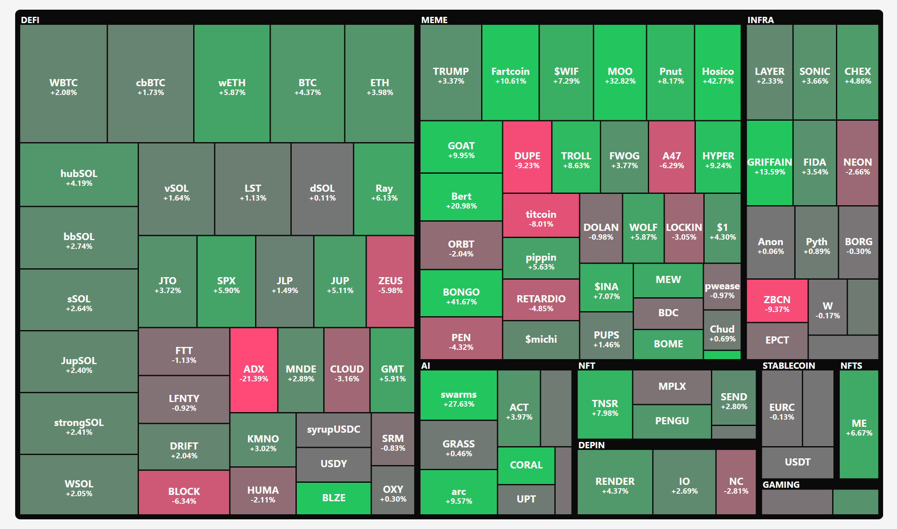

# Soldexer Stock Market Treemap

Interactive treemap visualization for Solana tokens price changes. Displays tokens as color-coded rectangles where size represents volume and colors show price movements (green = gains, red = losses).

## Prerequisites

-   Node.js (version 16+)
-   npm or yarn

## Quick Start

1. **Install dependencies**:

    ```bash
    npm install
    # or
    yarn install
    ```

2. **Run the application**:

    ```bash
    npm run dev
    # or
    yarn dev
    ```

3. **Open** `http://localhost:5173` in your browser

## ClickHouse Configuration

Create a `.env` file for real data (otherwise uses mock data):

```env
VITE_CLICKHOUSE_HOST=localhost
VITE_CLICKHOUSE_PORT=8123
VITE_CLICKHOUSE_USERNAME=default
VITE_CLICKHOUSE_PASSWORD=your_password
VITE_CLICKHOUSE_DATABASE=default
```

## Build for Production

```bash
npm run build
# or
yarn build
```

